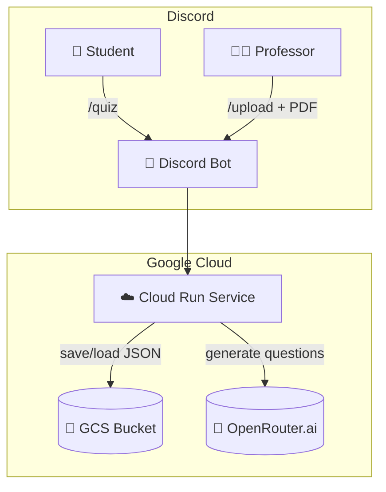

# 🤖 Discord Quiz Bot

[](https://console.cloud.google.com/run)
[](https://discord.com/developers/applications)
[](LICENSE)
[](https://github.com/YOUR_USERNAME/YOUR_REPO/actions)

An educational Discord bot that allows professors and students to interact through automatically generated True/False quizzes based on PDF documents. Fully automated, accessible, and deployed using **Google Cloud Run** and **GitHub Actions**.

---

## ✨ Features

👨‍🏫 **For Professors:**

- `/help` — Show all commands.
- `/upload_pdf <topic> <file>` — Upload a PDF and store it (no questions generated).
- `/upload_topic <topic> <file>` — Upload a PDF and automatically generate questions.
- `/generate_questions <topic> <qty> <type>` — Generate multiple questions using AI.
- `/add_question` — Add a custom question.
- `/list_questions <topic>` — List all questions for a topic.
- `/delete_question <topic> <id>` — Delete a question by its ID.
- `/stats` — Show global quiz statistics.
- `/user_stats` — Show per-user quiz attempts.
- `/time_stats` — Show quiz activity over time.
- `/quiz <topic>` — Launch a 5-question quiz for students.
- `/topics` — Display available quiz topics.
- `/my_rank` — View your XP and level.
- `/rank` — See the top 5 leaderboard.
- `/user_rank <name>` — Check another user’s rank.

👩‍🎓 **For Students:**

- `/help` — Show student commands.
- `/quiz <topic>` — Take a 5-question quiz.
- `/topics` — See all available topics.
- `/my_rank` — View your XP and level.
- `/rank` — See the top 5 leaderboard.

---

## 🧠 Architecture Overview



---

## 🚀 Deployment Steps (Cloud Run)

### 1. Build & Deploy using Docker

```bash
gcloud builds submit --tag gcr.io/YOUR_PROJECT_ID/discord-quiz-bot
gcloud run deploy discord-quiz-bot \
  --image gcr.io/YOUR_PROJECT_ID/discord-quiz-bot \
  --platform managed \
  --region europe-west1 \
  --allow-unauthenticated \
  --set-env-vars DISCORD_TOKEN=XXX,GCS_BUCKET_NAME=YYY,OPENROUTER_API_KEY=ZZZ
```

> ✅ Make sure you’ve enabled the Cloud Run and Cloud Build APIs.

---

### 2. Set Required Environment Variables

| Variable            | Description                              |
|---------------------|------------------------------------------|
| `DISCORD_TOKEN`     | Your bot token from Discord              |
| `GCS_BUCKET_NAME`   | GCS bucket to store JSON + PDFs          |
| `OPENROUTER_API_KEY`| API key from https://openrouter.ai       |

---

## ♻️ GitHub Action (Keep Bot Alive)

To avoid startup delays (cold starts), use this [GitHub Action](https://github.com/features/actions):

```yaml
# .github/workflows/ping.yml
name: Keep Bot Alive

on:
  schedule:
    - cron: '*/5 * * * *'
  workflow_dispatch:

jobs:
  ping:
    runs-on: ubuntu-latest
    steps:
      - name: Ping Cloud Run
        run: |
          curl -s https://your-cloud-run-url.run.app/ > /dev/null || echo "Ping failed"
```

---

## 📁 Project Structure

```
.
├── bot.py                # Main Discord bot logic
├── llm_utils.py          # PDF parsing and LLM integration
├── keep_alive.py         # Keeps container alive (Cloud Run)
├── Dockerfile            # Container setup
├── requirements.txt      # Python dependencies
├── .github/workflows/    # GitHub Actions workflows
└── preguntas.json        # Questions DB (auto-managed)
```

---

## 📄 License

This project is licensed under the MIT License — see the [LICENSE](LICENSE) file for details.

---

## 🙌 Acknowledgements

- Built with 💙 by [MarcGC21](https://github.com/marcgc21)
- Uses [Discord.py](https://discordpy.readthedocs.io/), [Google Cloud Run](https://cloud.google.com/run), and [OpenRouter](https://openrouter.ai)
